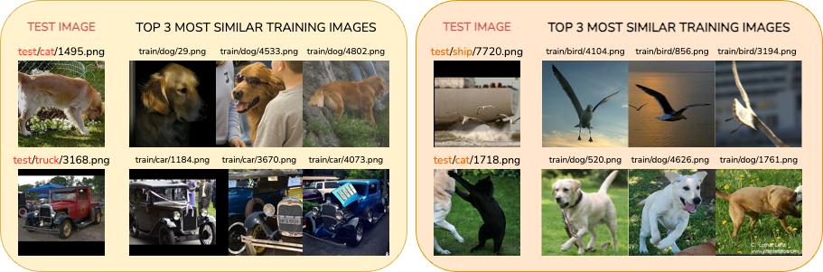

<!-- PROJECT LOGO -->
<br />
<p align="center">
  <a href="#">
    
  </a>

  <h3 align="center">An Embedding is Worth a Thousand Noisy Labels</h3>

  <p align="center">
    [<a href="https://openreview.net/pdf?id=X3gSvQjShh">TMLR'25</a>]
    [<a href="https://arxiv.org/abs/2408.14358">ArXiv</a>]
  </p>
</p>

We introduce `WANN`, a `Weighted Adaptive Nearest Neighbor` approach, relying on a reliability score quantifying the correctness of the training labels. Our experiments demonstrate its robustness, particularly in scenarios with limited labeled data, surpassing traditional models relying on robust loss functions. Notably, the benefits of WANN are evident in challenging situations, such as heavy class imbalances, through a weighted adaptive voting scheme. Additionally, the incorporation of dimensionality reduction techniques enhances its performance under noisy labels, facilitated by the proposed weighted scoring.

## Getting started

Make sure to use the proposed `conda` virtual environment.

```
conda env create -f environment.yml
conda activate wann-env
```

### External datasets & Loss config


* CIFAR-N: [link](https://github.com/UCSC-REAL/cifar-10-100n/tree/main/data)
* Animal10N: [link](https://dm.kaist.ac.kr/datasets/animal-10n/)
* DermaMNIST: [direct link](https://zenodo.org/records/10519652/files/dermamnist_224.npz)
* BreastMNIST: [direct link](https://zenodo.org/records/10519652/files/breastmnist_224.npz)

The configuration files for robust loss function can be found [here](https://github.com/Virusdoll/Active-Negative-Loss/tree/main/config), and should be placed under `assets/config`.


### Database

The first step is to download the desired dataset and locate them under `assets/data`. Then, to pre-generate the desired embeddings, use the following script.

```
python create_db.py --dataset_root=<ROOT PATH OF THE STORED DATASET>
                    --database_root=<ROOT PATH OF THE STORED DATABASES>
                    --dataset=<DATASET NAME>
                    --backbone=<DESIRED FEATURE EXTRACTOR>
                    --batch_size=<DESIRED BATCH SIZE>
```

> NOTE: for the medmnist datasets, pleause use `create_db_medmnist.py`

### WANN, ANN and $k$-NN

Nearest Neighbours-based experiments are entirely launched via `run_knn.py`.

```
python run_knn.py --experiment_name=<NAME OF THE EXPERIMENT (used for logging)>
                  --dataset=<DATASET NAME>
                  --database_root=<ROOT PATH OF THE STORED DATABASES>
                  --output_root=<ROOT PATH OF THE STORED LOGS>
                  --backbone=<DESIRED FEATURE EXTRACTOR>
                  --seed=<DESIRED SEED>
                  --method=<DESIRED METHOD : WANN | ANN | kNN>
                  --k=<DESIRED k : if --method=kNN>
                  --kmin=<DESIRED kmin : if --method=WANN|ANN>
                  --kmax=<DESIRED kmax : if --method=WANN|ANN>
                  --noise_pattern=<DESIRED NOISE PATTERN : sym|asym|instance|None>
                  --noise_ratio=<DESIRED NOISE RATIO>
                  --num_subsamples=<DESIRED TOTAL NUMBER OF SUBSAMPLES>
                  --imbalance_ratio=<DESIRED IMBALANCED RATIO (LONG TAIL)>
                  --dimensionality_reduction=<DESIRED DIMENSIONALITY REDUCTION METHOD>
```

### Linear probing
For a fair comparison with `WANN`, we used fixed learning hyperparameters for each experiment. 

```
python run_linear_train.py --experiment_name=<NAME OF THE EXPERIMENT (used for logging & ckpts)>
                           --database_root=<ROOT PATH OF THE STORED DATABASES>
                           --store_ckpt_path=<ROOT PATH OF THE STORED CHECKPOINTS>
                           --dataset=<DATASET NAME>
                           --backbone=<DESIRED FEATURE EXTRACTOR>
                           --seed=<DESIRED SEED>
                           --noise_pattern=<DESIRED NOISE PATTERN : sym|asym|instance|None>
                           --noise_ratio=<DESIRED NOISE RATIO>
                           --num_subsamples=<DESIRED TOTAL NUMBER OF SUBSAMPLES>
                           --batch_size=<BATCH SIZE> 
                           --loss_function=<LOSS FUNCTION>
```

> NOTE: All the training hyperparams are defined as arguments as well.

```
python run_linear_inference.py --experiment_name=<NAME OF THE EXPERIMENT (used for logging & ckpts)>
                               --database_root=<ROOT PATH OF THE STORED DATABASES>
                               --output_root=<ROOT PATH OF THE STORED LOGS>
                               --store_ckpt_path=<ROOT PATH OF THE STORED CHECKPOINTS>
                               --dataset=<DATASET NAME>
                               --backbone=<DESIRED FEATURE EXTRACTOR>
                               --loss_function=<LOSS FUNCTION (used to automatically retrieve the ckpts)>
                               --seed=<DESIRED SEED>
                               --noise_pattern=<DESIRED NOISE PATTERN : sym|asym|instance|None>
                               --noise_ratio=<DESIRED NOISE RATIO>
                               --num_subsamples=<DESIRED TOTAL NUMBER OF SUBSAMPLES>
```

> NOTE: Training hyperparameters (e.g., `seed`, `num_subsamples`, `imbalance_ratio`, and more) are required to normalize the test embeddings according to the appropriate training statistics and for logging purposes.


# Citation

If you find this work useful, please consider citing us:
```
@article{disalvo2025an,
title={An Embedding is Worth a Thousand Noisy Labels},
author={Francesco Di Salvo and Sebastian Doerrich and Ines Rieger and Christian Ledig},
journal={Transactions on Machine Learning Research},
issn={2835-8856},
year={2025},
url={https://openreview.net/forum?id=X3gSvQjShh},
}
```
